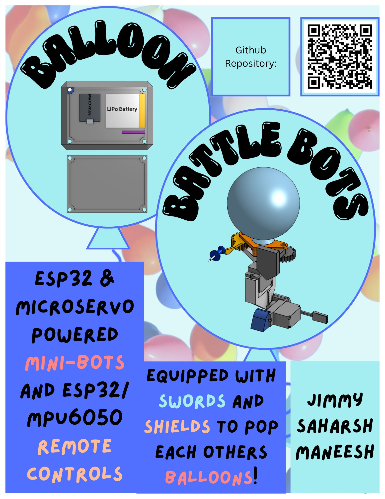
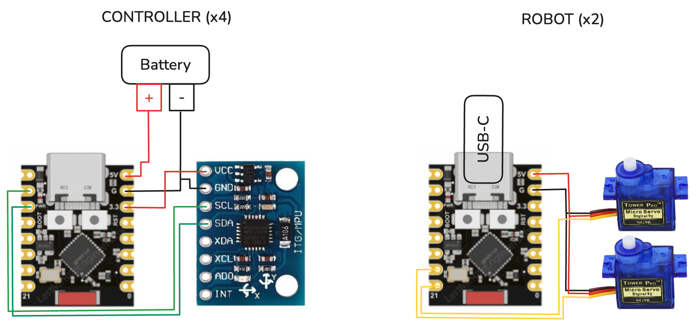

# Balloon Battle Bots
Miniature robots powered by ESP32, servo motors, and remote control IMUs battle it out to pop the other robot's balloon! Made for Hack Club Outpost Hackathon :)

[Demo Video](https://youtu.be/fRwY6rqtH1o): https://youtu.be/fRwY6rqtH1o

## How to Use
First, Make sure all the batteries are connected to the ESP32s.
Hold the controllers in the correct hands as labeled. 

    Controls: 
        Right Hand Punch: Sword Jab 
        Left Hand Punch: Shield Block 
        Both Hands Move Forward: Tilt Forward 
        Both Hands Move Back: Tilt Back 

The match ends when a balloon is popped; the player with the un-popped balloon wins. 

## How it Works
1. Each controller has an ESP32-C3 Mini microcontroller connected to a 3.7v LiPo battery and a MPU6050 accelerometer.
2. Each robot has an ESP32-C3 Mini microcontroller connected to 2 SG90 Micro-Servos. 
3. Movements from the controllers are detected by the MPU6050s and if the movement is enough to be considered an action control, a signal is sent to the robots.
4. Based on the received signal, the movement is made. One servo determines sideways (sword/shield), and one servo determines forward/backward tilt. 
5. The sword has a pushpin that can prick the balloon on the opposite robot, causing it to pop. 

## Tech Stack
- Onshape (CAD)
- Arduino IDE
- Cirkit Designer (Wiring Diagram)
- AI used for debugging and programming

## Images
Wiring Diagram: \

CAD: \

Side View Robot: \

Top View Case: \

## Bill of Materials (BOM)
[BOM.csv](BOM.csv)
| Item | Qty | Price (USD) | Source / Link | Notes |
|------|----:|------------:|---------------|-------|
| Water Balloons Pack | 1 | $2.99 | https://www.cvs.com/shop/ja-ru-water-balloons-with-filler-150-ct-prodid-599103 | |
| Push Pins | 1 | $2.99 | https://www.cvs.com/shop/caliber-push-pins-prodid-247031 | |
| Delivery Costs | 1 | $7.00 | — | Uber Eats delivery of CVS items |
| 3D Printed Parts | 1 | — | Outpost Hardware Bar | 3D printed parts |
| SG90 Micro Servo | 2 | — | Outpost Hardware Bar | Servo motors |
| ESP32-C3 Mini | 6 | — | Outpost Hardware Bar | Microcontrollers |
| MPU6050 | 4 | — | Outpost Hardware Bar | Accelerometers |
| M3 Screws | 28 | — | Outpost Hardware Bar | Connectors |
| M3 Nuts | 28 | — | Outpost Hardware Bar | Connectors |
| 3.7V LiPo Battery | 6 | — | Outpost Hardware Bar | Power source |
| Assorted Jumper Wires | — | — | Outpost Hardware Bar | Wiring |
| Electrical Tape | — | — | Outpost Hardware Bar | Electrical insulation |

## Motivation
This was a cool electronic hardware project that replicated one of Jimmy's childhood wooden games :) We want to present this at Open Sauce 2026. 
